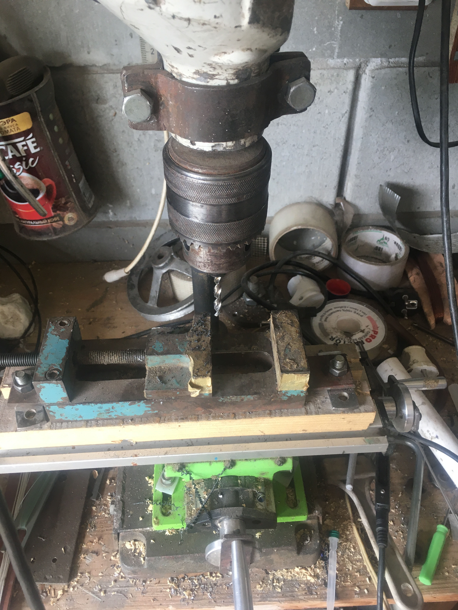
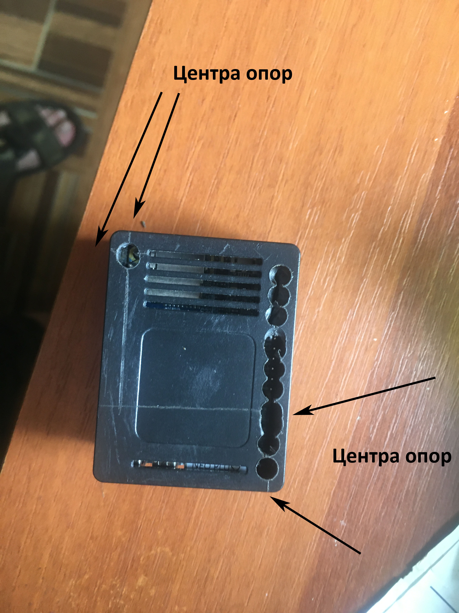
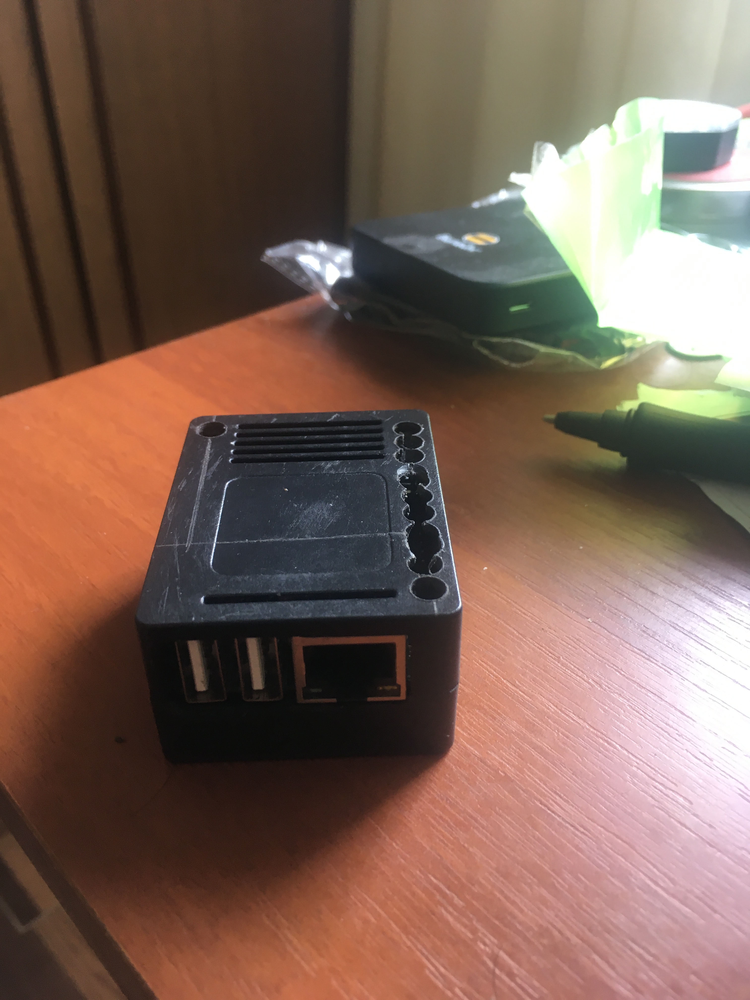
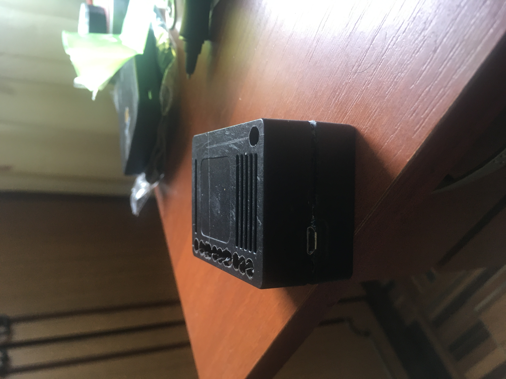

# Ripe Atlas v4 disassembly
## Введение
Есть такая замечательная штука https://labs.ripe.net/author/alun_davies/new-ripe-atlas-version-4-probes/
на основе **NanoPi NEO Plus2 with 512MB RAM**
Как то у меня закончились порты в маршрутизаторе и мои ручки потянулись к разборке уже не нужного девайса.

## Подготовка
Итак вам необходим сам **Ripe Atlas v4** его не сложно получить на сайте. 
Примерно такая сверлилка 

дальше размечаете верхнюю крышку по вот этому рисунку

и сверлите сверлом ∅8 или ∅6
то что у меня насверлено это лишнее, достаточно этих 2, смысл в том что в этой коробочке 2 штыря которые вроде бы склеены, в центре и надеты на сам модуль, так что без деструктива не обойтись.
Но у вас будет аккуратней. 

Итак дальше передняя сторона

В оригинале открыт только сетевой порт, соответственно делаете пропил у самой стенки ножовкой по металлу и пропил от сетевого порта, 
потом подгоняете по месту ножом что бы порты нормально выглядывали, ну или дрюмелем

Теперь задняя часть

тут тем же ножом или дрюмелем пропиливаете отверстие под microsd card

